# P3 · Infraestructura 2 — VPN Site-to-Site y Jump Server con RemoteApp

**Jose Gabriel Feliz Maria · Matrícula: 2025-0742**
**Seguridad de Redes · ITLA**

---

## 🎥 Video Demostrativo

**[Ver demostración en YouTube](PEGAR_AQUI_EL_LINK_DEL_VIDEO)** ⚠️ *(pendiente de grabar/subir)*

En el video se muestra la hora y fecha del sistema, el rostro y la voz del autor, y la demostración de que la topología cumple su objetivo de seguridad: los usuarios solo llegan al Jump Server a través de la VPN, el Jump Server es el único que alcanza al Web Server (HTTPS, RDP y SSH), el usuario sin privilegios solo tiene publicada la aplicación web y el FortiGate le niega el SSH hacia los servidores.

---

## 📋 Tabla de Contenido

1. [Propósito del Laboratorio](#1-propósito-del-laboratorio)
2. [Topología](#2-topología)
3. [Direccionamiento IP](#3-direccionamiento-ip)
4. [Decisiones de Diseño](#4-decisiones-de-diseño)
5. [Sitio Cliente: ISP, R-CLIENTE y SW-A](#5-sitio-cliente-isp-r-cliente-y-sw-a)
6. [FortiGate: Red (GUI)](#6-fortigate-red-gui)
7. [VPN Site-to-Site (Cisco ⇄ FortiGate)](#7-vpn-site-to-site-cisco--fortigate)
8. [FortiGate: Objetos y Políticas (GUI)](#8-fortigate-objetos-y-políticas-gui)
9. [Jump Server: RDS, RemoteApp y Web Client](#9-jump-server-rds-remoteapp-y-web-client)
10. [Web Server: Sistema de Caja](#10-web-server-sistema-de-caja)
11. [Pruebas y Verificación](#11-pruebas-y-verificación)
12. [Problemas Encontrados y Soluciones](#12-problemas-encontrados-y-soluciones)
13. [Scripts y Running-Configs](#13-scripts-y-running-configs)
14. [Evidencias (Capturas)](#14-evidencias-capturas)
15. [Notas y Limitaciones del Laboratorio](#15-notas-y-limitaciones-del-laboratorio)

---

## 1. Propósito del Laboratorio

Dar acceso a un servidor crítico (el Web Server del **Sistema de Caja**) sin exponerlo nunca directamente a los usuarios. Los usuarios están en otro sitio, llegan por una **VPN site-to-site** y solo pueden hablar con un **Jump Server**, que les publica las herramientas como **RemoteApp**. El **FortiGate** controla cada salto. Los objetivos de seguridad son:

1. **VPN entre el sitio Cliente y el sitio Servidor**, sobre un ISP con direcciones públicas.
2. **La VPN solo da acceso al Jump Server.** Ningún usuario llega al Web Server por la VPN.
3. **El Jump Server solo llega al Web Server por HTTPS, RDP y SSH.**
4. **Usuario sin privilegios:** solo tiene publicada la aplicación web en el Jump Server, y hay una **política explícita** que le niega el SSH hacia los servidores.
5. **Usuario con privilegios:** tiene publicadas la aplicación web, PuTTY (SSH) y Escritorio remoto (RDP) en el Jump Server.

Toda la configuración y demostración del FortiGate se hizo por **interfaz gráfica (GUI)**; solo el acceso inicial se hizo por consola. Los equipos Cisco se configuraron por CLI.

---

## 2. Topología

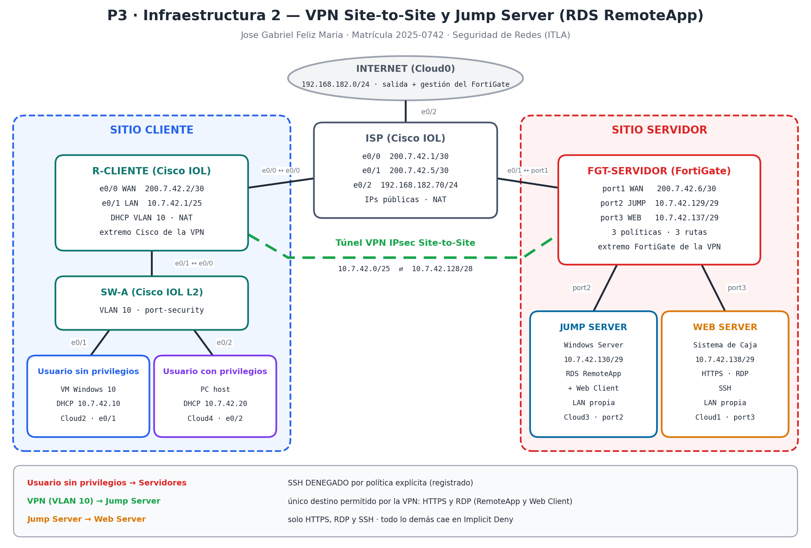

Topología montada en PNETLab:

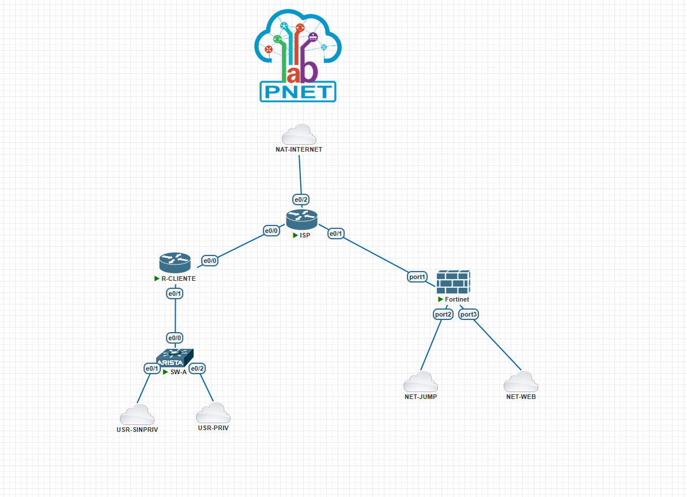

| Equipo | Rol |
|---|---|
| **ISP** | Router Cisco IOL: entrega las IP públicas a los dos sitios y la salida a Internet |
| **R-CLIENTE** | Router Cisco IOL: gateway y DHCP de la VLAN 10, NAT y extremo Cisco de la VPN |
| **SW-A** | Switch Cisco IOL: VLAN 10 de los usuarios y seguridad básica de puertos |
| **FGT-SERVIDOR** (nodo *Fortinet*) | FortiGate del sitio Servidor: extremo de la VPN, separa las dos LAN de servidores y aplica las políticas. La VM conserva su nombre de equipo por defecto (`FortiGate-VM64-KVM`) |
| **Jump Server** (NET-JUMP) | Windows Server 2022 con Remote Desktop Services: RemoteApp y RemoteApp Web Client |
| **Web Server** (NET-WEB) | Linux con el Sistema de Caja por HTTPS, más SSH y RDP |
| **USR-SINPRIV** | VM Windows 10: usuario sin privilegios |
| **USR-PRIV** | PC del administrador: usuario con privilegios |
| **NAT-INTERNET** | Salida a Internet (NAT de VMware) y red desde la que se administra la GUI del FortiGate |

---

## 3. Direccionamiento IP

Direccionamiento basado en la matrícula **2025-0742**: `10.7.42.0/24` para las redes privadas y `200.7.42.0/29` para los enlaces públicos.

| Red | Subred | Gateway | Uso |
|---|---|---|---|
| VLAN 10 – Usuarios | `10.7.42.0/25` | `10.7.42.1` (R-CLIENTE) | DHCP `10.7.42.10 – 10.7.42.126` |
| LAN del Jump Server | `10.7.42.128/29` | `10.7.42.129` (FortiGate port2) | Jump Server `.130` |
| LAN del Web Server | `10.7.42.136/29` | `10.7.42.137` (FortiGate port3) | Web Server `.138` |
| Enlace público ISP ↔ R-CLIENTE | `200.7.42.0/30` | — | ISP `.1` · R-CLIENTE `.2` |
| Enlace público ISP ↔ FortiGate | `200.7.42.4/30` | — | ISP `.5` · FortiGate `.6` |
| Internet / gestión | `192.168.182.0/24` | `192.168.182.2` | ISP `.70` · GUI del FortiGate publicada en `.71` |

| Equipo | Interfaz | IP |
|---|---|---|
| ISP | e0/0 · e0/1 · e0/2 | `200.7.42.1/30` · `200.7.42.5/30` · `192.168.182.70/24` |
| R-CLIENTE | e0/0 · e0/1 | `200.7.42.2/30` · `10.7.42.1/25` |
| SW-A | Vlan10 | `10.7.42.2/25` |
| FGT-SERVIDOR | port1 (WAN_ISP) | `200.7.42.6/30` |
| FGT-SERVIDOR | port2 (LAN_JUMP) | `10.7.42.129/29` |
| FGT-SERVIDOR | port3 (LAN_WEB) | `10.7.42.137/29` |
| Jump Server | Ethernet | `10.7.42.130/29` |
| Web Server | eth1 | `10.7.42.138/29` |
| Usuario sin privilegios (VM Windows 10) | Ethernet | DHCP reservado `10.7.42.10/25` |
| Usuario con privilegios (PC) | VMnet8 | DHCP reservado `10.7.42.20/25` |

---

## 4. Decisiones de Diseño

La licencia de evaluación de FortiGate VM permite como máximo **3 interfaces, 3 políticas de firewall y 3 rutas**, y solo cifrado **DES**. El diseño se ajustó a ese límite sin dejar ningún requisito fuera:

| Recurso | Límite | Uso en este laboratorio |
|---|---|---|
| Interfaces | 3 | port1 (ISP) · port2 (Jump Server) · port3 (Web Server) |
| Políticas | 3 | Negar SSH al usuario sin privilegios · VPN → Jump Server · Jump Server → Web Server |
| Rutas | 3 | Ruta por defecto · red de usuarios por el túnel · *blackhole* de respaldo |

- **Cada servidor en su propia LAN `/29`.** Como el Jump Server y el Web Server están en puertos distintos del FortiGate, todo lo que va de uno al otro pasa obligatoriamente por una política.
- **El usuario se identifica de dos formas.** Para el FortiGate, por su **IP**: el R-CLIENTE le reserva por DHCP siempre la misma dirección a cada usuario (`.10` sin privilegios, `.20` con privilegios), y la política de negación usa esa IP. Para el Jump Server, por su **grupo del dominio**: cada RemoteApp se publica solo a los grupos que deben verla.
- **La negación explícita va primero.** Las políticas se evalúan en orden, así que `DENY_SSH_SIN_PRIVILEGIOS` está arriba de las de permiso. Para cubrir las dos LAN de servidores con una sola política se activó *Feature Visibility → Multiple Interface Policies*.
- **La protección del Web Server no gasta políticas.** No existe ninguna política de la VPN hacia la LAN del Web Server, así que ese tráfico cae en el *Implicit Deny*.
- **Gestión del FortiGate sin interfaz dedicada.** Los tres puertos están ocupados, así que el ISP publica la IP pública del FortiGate (`200.7.42.6`) como `192.168.182.71` en la red de gestión, y la GUI se abre desde ahí.
- **Los servidores no tienen salida a Internet.** No hay política desde las LAN de servidores hacia el ISP. Solo se les dio Internet de forma temporal para instalar paquetes, y se retiró.
- **Jump Server sobre un dominio existente.** Remote Desktop Services necesita un dominio de Active Directory; se usó un Windows Server 2022 de laboratorio que ya era controlador del dominio `jose.gabriel`.

---

## 5. Sitio Cliente: ISP, R-CLIENTE y SW-A

### ISP

Simula al proveedor: tiene las dos redes públicas `/30`, hace NAT (PAT) hacia Internet y **no conoce las redes privadas** `10.7.42.x`, igual que el Internet real. Por eso los usuarios solo pueden llegar a los servidores a través de la VPN.

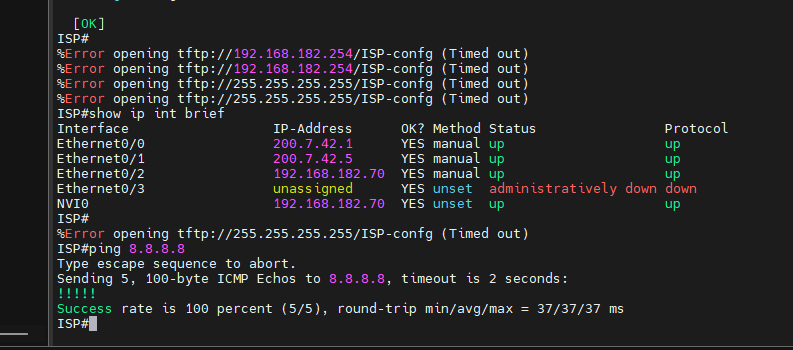

### R-CLIENTE

- Gateway de la VLAN 10 (`10.7.42.1/25`) y servidor **DHCP**, con una **reserva por MAC** para cada usuario.
- **NAT** hacia el ISP, con una excepción para que el tráfico hacia los servidores no se traduzca y entre al túnel.
- Extremo Cisco de la **VPN IPsec**.
- Seguridad básica: `enable secret`, `service password-encryption`, banner, y administración solo por **SSH v2** y solo desde el usuario con privilegios (`access-class 20`).

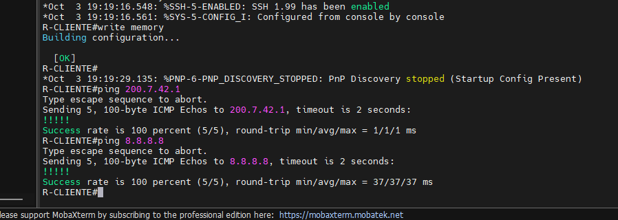

### SW-A

- **VLAN 10 (USUARIOS)** en los puertos del router y de los dos usuarios; **VLAN 999 (SIN-USO)** para el puerto libre, que queda apagado.
- **Port-security** (máximo 3 MAC, *sticky*, violación *restrict*), **PortFast** y **BPDU Guard** en los puertos de usuario.
- Administración por SSH v2, solo desde el usuario con privilegios.

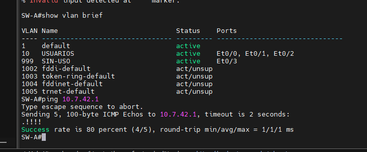

El usuario con privilegios recibe por DHCP su dirección reservada:

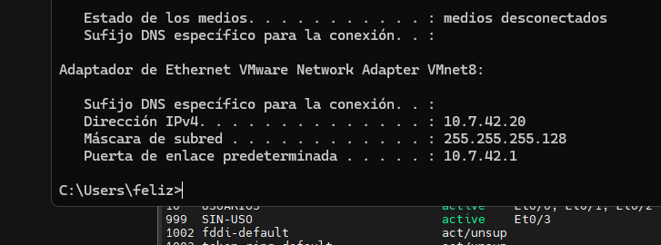

Scripts: [`scripts/ISP_config.txt`](scripts/ISP_config.txt) · [`scripts/R-CLIENTE_config.txt`](scripts/R-CLIENTE_config.txt) · [`scripts/SW-A_config.txt`](scripts/SW-A_config.txt)

---

## 6. FortiGate: Red (GUI)

Acceso inicial por consola: [`scripts/FGT-SERVIDOR_acceso_inicial_CLI.txt`](scripts/FGT-SERVIDOR_acceso_inicial_CLI.txt). Todo lo demás por GUI:

| Paso (GUI) | Configuración |
|---|---|
| Network → Interfaces → port1 | `WAN_ISP` · `200.7.42.6/255.255.255.252` · HTTP y PING |
| Network → Interfaces → port2 | `LAN_JUMP` · `10.7.42.129/255.255.255.248` · solo PING |
| Network → Interfaces → port3 | `LAN_WEB` · `10.7.42.137/255.255.255.248` · solo PING |
| Network → Static Routes | `0.0.0.0/0` → `200.7.42.5` (port1) |
| System → Feature Visibility | *Multiple Interface Policies* activado |

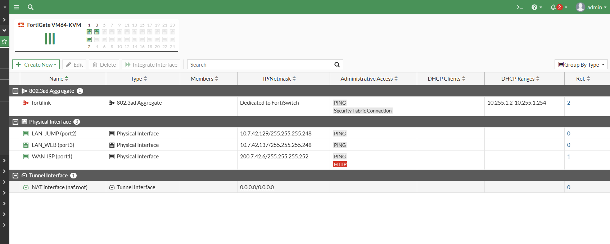

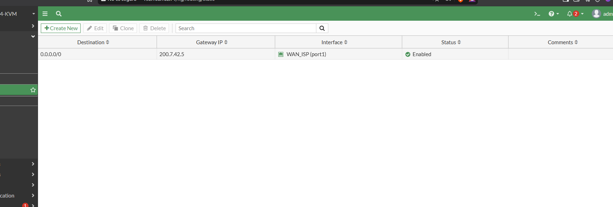

Los dos sitios se ven por sus IP públicas:

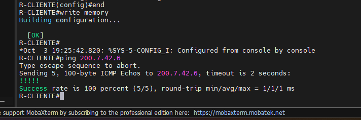

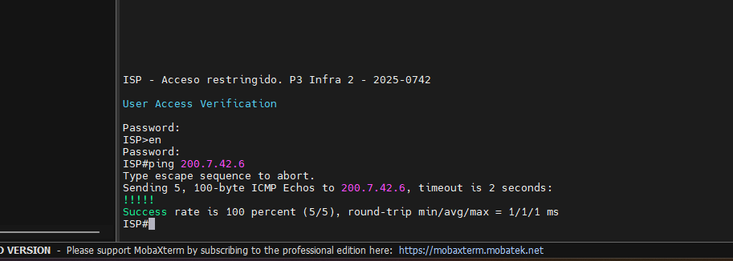

---

## 7. VPN Site-to-Site (Cisco ⇄ FortiGate)

Túnel IPsec entre `200.7.42.2` (R-CLIENTE) y `200.7.42.6` (FGT-SERVIDOR). En el FortiGate se creó con el asistente **VPN → IPsec Wizard** (`VPN_CLIENTE`, *Site to Site*); en el Cisco, con *crypto map*.

| Parámetro | Valor (igual en los dos extremos) |
|---|---|
| IKE | Versión 1, clave precompartida |
| Fase 1 | DES · SHA1 · DH grupo 14 · 86400 s |
| Fase 2 | ESP DES · SHA1 · PFS grupo 14 · 43200 s |
| Redes protegidas | `10.7.42.0/25` (usuarios) ⇄ `10.7.42.128/28` (las dos LAN de servidores) |

El FortiGate propone `des-md5` y `des-sha1`, y el Cisco solo acepta DES con SHA1, que es lo que se negocia.

- El asistente del FortiGate crea la interfaz de túnel `VPN_CLIENTE`, la ruta hacia `10.7.42.0/25` por el túnel y una ruta *blackhole* de respaldo.
- Las dos políticas que crea el asistente (todo permitido entre las dos redes) se **reemplazaron** por las políticas restrictivas de la sección 8.
- La clave precompartida no se publica en este repositorio.

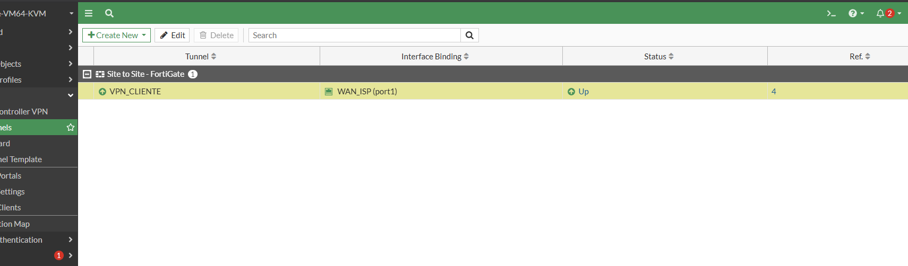

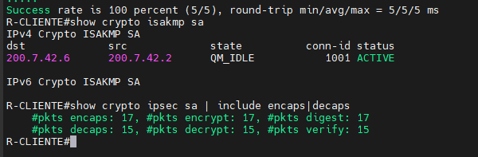

Primera prueba del túnel, todavía con las políticas del asistente:

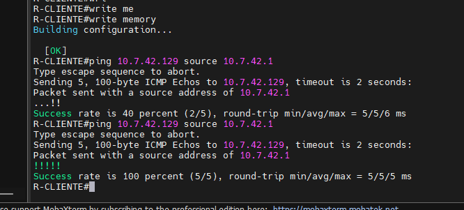

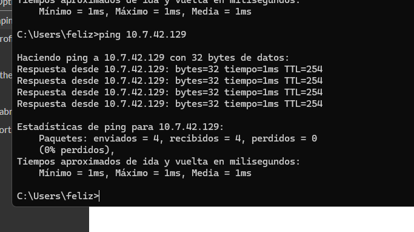

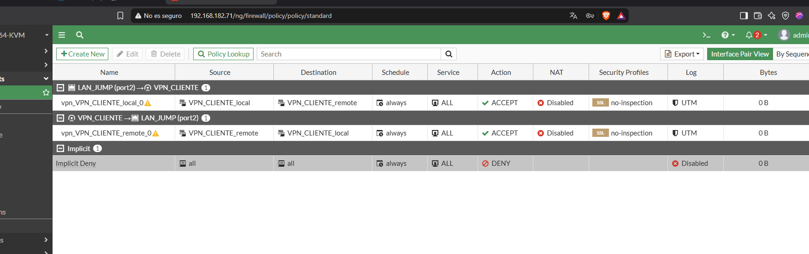

---

## 8. FortiGate: Objetos y Políticas (GUI)

### 8.1 Direcciones

| Objeto | Tipo | Valor |
|---|---|---|
| `VPN_CLIENTE_remote` | Grupo (asistente) | `10.7.42.0/25` – usuarios de la VLAN 10 |
| `USR_SIN_PRIVILEGIOS` | Subnet | `10.7.42.10/32` |
| `JUMP_SERVER` | Subnet | `10.7.42.130/32` |
| `WEB_SERVER` | Subnet | `10.7.42.138/32` |
| `SERVIDORES` | Subnet | `10.7.42.128/28` – las dos LAN de servidores |

### 8.2 Políticas

| # | Política | Desde → Hacia | Origen → Destino | Servicio | Acción |
|---|---|---|---|---|---|
| 1 | `DENY_SSH_SIN_PRIVILEGIOS` | VPN_CLIENTE → LAN_JUMP + LAN_WEB | `USR_SIN_PRIVILEGIOS` → `SERVIDORES` | SSH | **DENY** |
| 2 | `VPN_A_JUMP` | VPN_CLIENTE → LAN_JUMP | `VPN_CLIENTE_remote` → `JUMP_SERVER` | HTTPS, RDP | ACCEPT |
| 3 | `JUMP_A_WEB` | LAN_JUMP → LAN_WEB | `JUMP_SERVER` → `WEB_SERVER` | HTTPS, RDP, SSH | ACCEPT |
| — | *Implicit Deny* | cualquiera | todo lo demás | ALL | DENY, con registro |

Las tres políticas registran todas las sesiones y ninguna usa NAT. Cómo cubre cada requisito:

- **La VPN solo da acceso al Jump Server:** la única política de permiso desde la VPN tiene como destino `JUMP_SERVER`, y solo por HTTPS y RDP, que es lo que usan RD Web y las RemoteApp. No hay ninguna política de la VPN hacia `LAN_WEB`.
- **El Jump Server solo llega al Web Server por HTTPS, RDP y SSH:** `JUMP_A_WEB` tiene como origen únicamente la IP del Jump Server y esos tres servicios.
- **SSH restringido al usuario sin privilegios:** `DENY_SSH_SIN_PRIVILEGIOS` es una negación explícita, con registro, para la IP de ese usuario hacia las dos LAN de servidores.
- **El Web Server no inicia conexiones:** no hay política desde `LAN_WEB` hacia ningún lado.

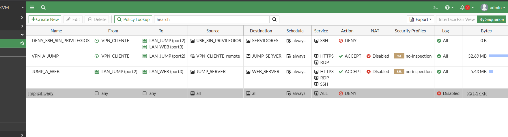

En el *Implicit Deny* se activó *Log IPv4 Violation Traffic*, para que todo lo que no coincide con ninguna política quede registrado:

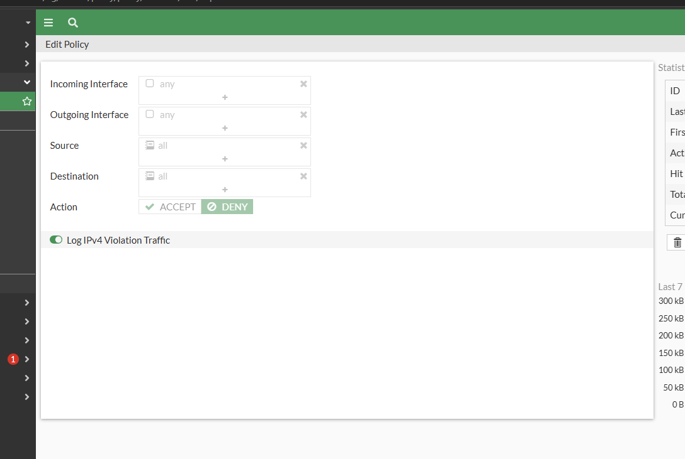

---

## 9. Jump Server: RDS, RemoteApp y Web Client

Windows Server 2022 (`WIN-3PRJM03EJ6S.jose.gabriel`, `10.7.42.130`). El servidor se administra por Escritorio remoto a través de la VPN.

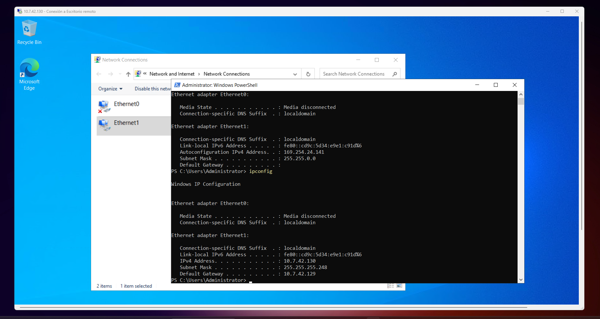

### 9.1 Roles de Remote Desktop Services

Instalación por asistente: *Server Manager → Add roles and features → Remote Desktop Services installation → Quick Start → Session-based desktop deployment*. Después se agregó **RD Gateway** desde *Deployment Overview*.

| Rol | Para qué sirve aquí |
|---|---|
| RD Connection Broker | Administra la colección y las sesiones |
| RD Web Access | Portal `https://…/RDWeb` donde cada usuario ve sus aplicaciones |
| RD Session Host | Ejecuta las RemoteApp |
| RD Gateway | Entrada por HTTPS para las conexiones a las RemoteApp |

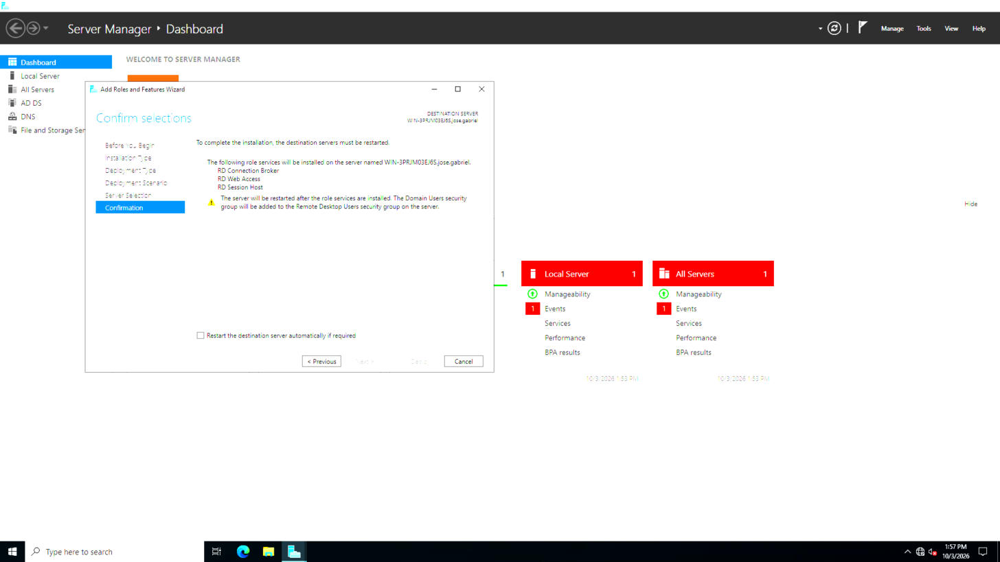

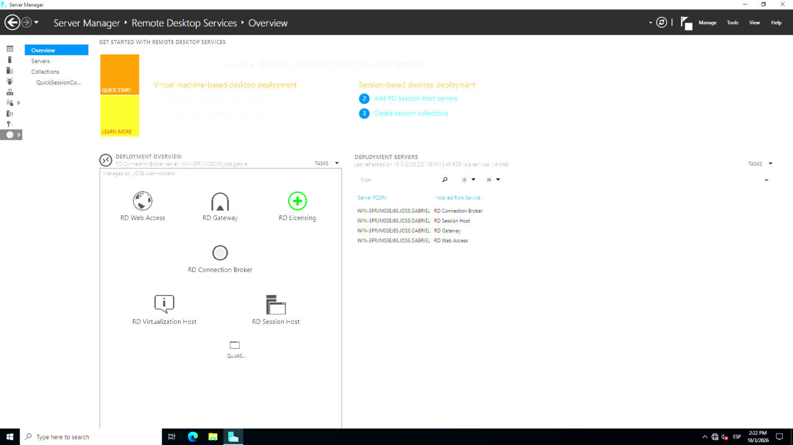

Los cuatro roles usan un certificado autofirmado con el nombre del servidor. Los equipos de los usuarios lo agregan una vez a sus entidades de confianza con [`scripts/cliente_confiar_certificado_jump.ps1`](scripts/cliente_confiar_certificado_jump.ps1).

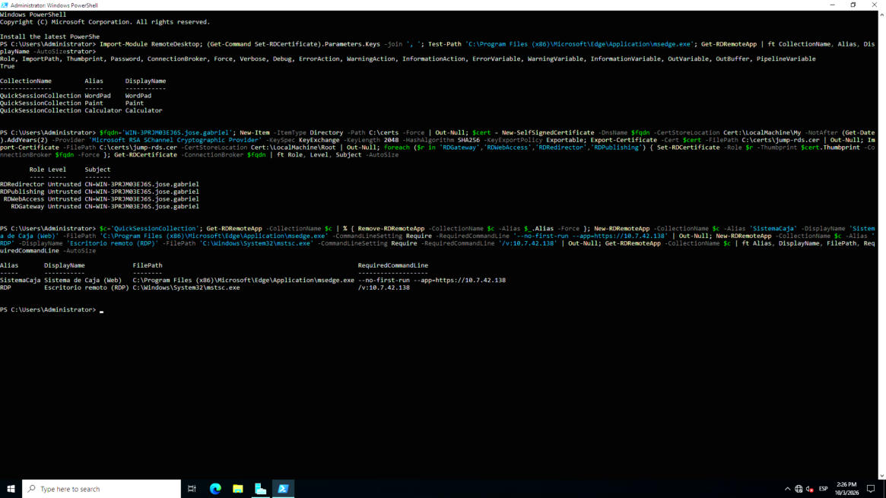

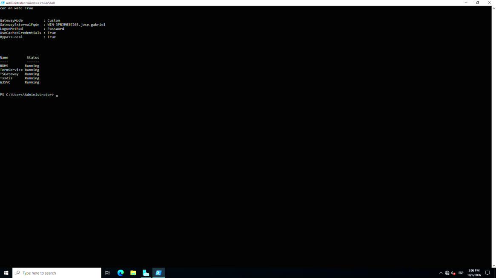

### 9.2 RemoteApp publicadas por grupo

| RemoteApp | Programa en el Jump Server | Destino fijo | Quién la ve |
|---|---|---|---|
| **Sistema de Caja (Web)** | Microsoft Edge en modo aplicación | `https://10.7.42.138` | `GRP_SinPrivilegios` y `GRP_Privilegiados` |
| **PuTTY (SSH)** | `putty.exe` | `-ssh admincaja@10.7.42.138` | Solo `GRP_Privilegiados` |
| **Escritorio remoto (RDP)** | `mstsc.exe` | `/v:10.7.42.138` | Solo `GRP_Privilegiados` |

- Cada RemoteApp tiene su línea de comandos **obligatoria** (*Require*), así que el usuario no puede cambiar el destino.
- `GRP_SinPrivilegios` y `GRP_Privilegiados` son grupos de seguridad del dominio; cada usuario pertenece a uno solo.
- PuTTY se descargó del sitio oficial y se comprobó su firma digital antes de instalarlo.

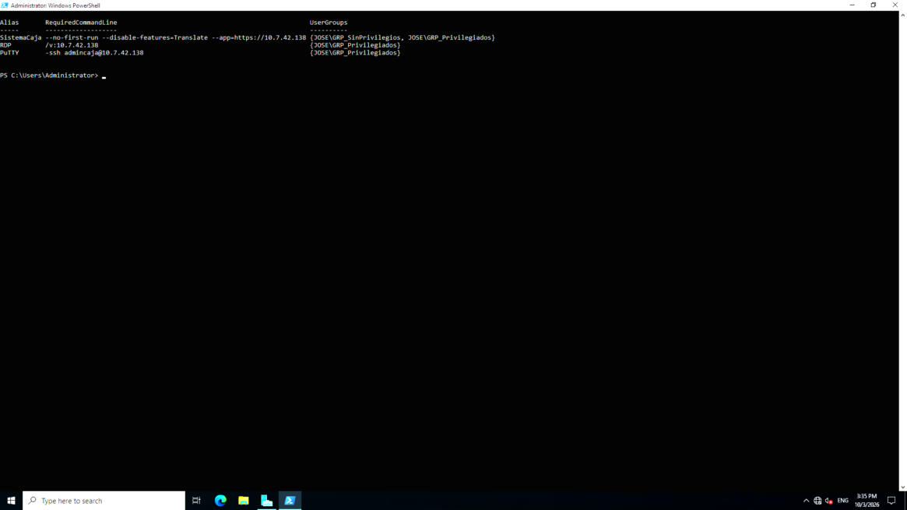

### 9.3 RemoteApp Web Client (HTML5)

Se instaló el cliente web de Escritorio remoto (`RDWebClientManagement`), que permite abrir las RemoteApp **dentro del navegador**, sin descargar archivos `.rdp`.

| Acceso | Dirección |
|---|---|
| RD Web (clásico, descarga un `.rdp`) | `https://WIN-3PRJM03EJ6S.jose.gabriel/RDWeb` |
| RemoteApp Web Client (HTML5) | `https://WIN-3PRJM03EJ6S.jose.gabriel/RDWeb/webclient/index.html` |

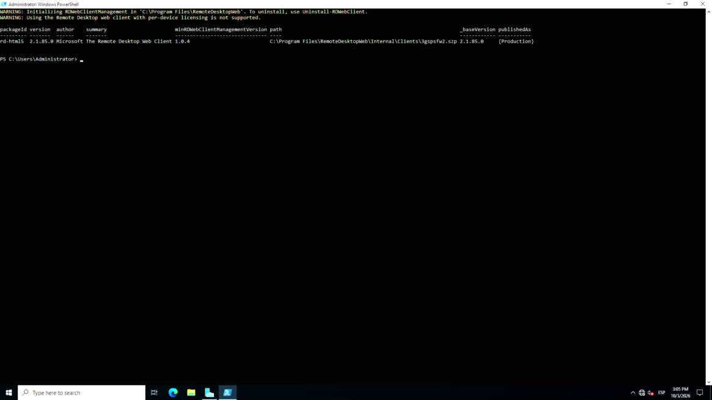

Script con todo lo configurado por PowerShell: [`scripts/JUMP-SRV_rds_remoteapp.ps1`](scripts/JUMP-SRV_rds_remoteapp.ps1)

---

## 10. Web Server: Sistema de Caja

Servidor Linux (Kali) en la LAN `10.7.42.136/29`, con los tres servicios que el Jump Server puede usar:

| Servicio | Puerto | Software | Detalle |
|---|---|---|---|
| **HTTPS** | 443 | Apache | Página del Sistema de Caja, con certificado autofirmado |
| **SSH** | 22 | OpenSSH | Usuario `admincaja` |
| **RDP** | 3389 | xrdp + XFCE | Escritorio del usuario `admincaja` |

La contraseña de `admincaja` se define al crear el usuario y no se guarda en el repositorio.

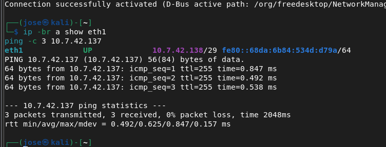

El servidor queda solo con la interfaz de su LAN (`eth1`) y los tres puertos en escucha:

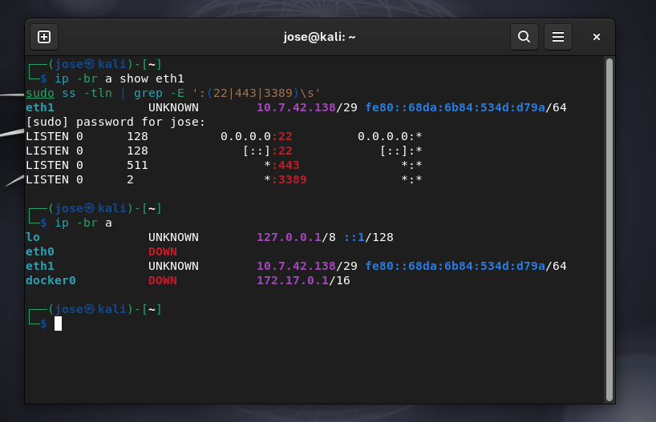

Script: [`scripts/kali_web_server_infra2.sh`](scripts/kali_web_server_infra2.sh)

---

## 11. Pruebas y Verificación

| # | Requisito | Prueba | Resultado |
|---|---|---|---|
| 1 | ISP con IP públicas | `ping` entre `200.7.42.2` y `200.7.42.6`, y hacia Internet | ✅ Responde |
| 2 | VLAN 10 con DHCP | `ipconfig` en el usuario con privilegios | ✅ `10.7.42.20` (reserva) |
| 3 | VPN site-to-site | `show crypto isakmp sa` · estado del túnel en el FortiGate | ✅ `QM_IDLE / ACTIVE` · *Up* |
| 4 | **La VPN solo da acceso al Jump Server** | `ping 10.7.42.138` desde un usuario | ✅ 100% de pérdida |
| 5 | **Jump Server → Web Server: HTTPS, RDP, SSH** | Prueba de los puertos 443, 3389 y 22 desde el Jump Server | ✅ Los tres abren |
| 6 | Sistema de Caja | `https://10.7.42.138` desde el Jump Server | ✅ Abre la página |
| 7 | **Usuario con privilegios** | RD Web con `gabriel` | ✅ Ve las **tres** aplicaciones |
| 8 | RemoteApp RDP | *Escritorio remoto (RDP)* | ✅ Abre el escritorio del Web Server |
| 9 | RemoteApp PuTTY | *PuTTY (SSH)* | ✅ Sesión SSH como `admincaja` en el Web Server |
| 10 | RemoteApp Web | *Sistema de Caja (Web)* | ✅ Abre el Sistema de Caja |
| 11 | RemoteApp Web Client | Cliente HTML5 en el navegador | ✅ La aplicación corre dentro del navegador |
| 12 | **Usuario sin privilegios** | RD Web con `pedrito` | ✅ Ve **solo** *Sistema de Caja (Web)* |
| 13 | **SSH restringido** | `ssh admincaja@10.7.42.138` y `ssh admincaja@10.7.42.130` desde el usuario sin privilegios | ✅ *Connection timed out* en los dos |
| 14 | Servidores sin Internet | Log & Report → Forward Traffic | ✅ Sus intentos de salida quedan como *Deny: policy violation* |
| 15 | Registro del SSH negado | Forward Traffic filtrado por `10.7.42.10` | ✅ *Deny* por `DENY_SSH_SIN_PRIVILEGIOS` hacia los dos servidores |

### La VPN solo da acceso al Jump Server

Con la VPN arriba, el usuario no llega al Web Server:

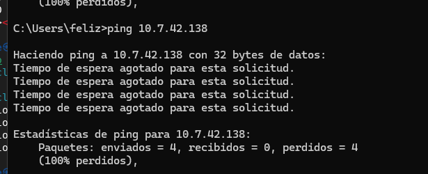

### Jump Server → Web Server

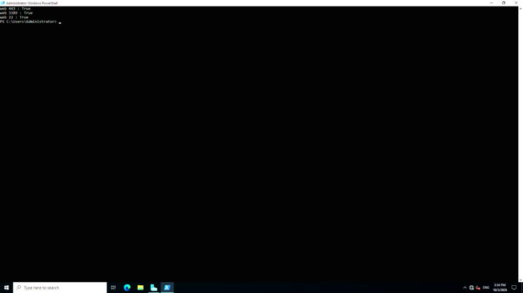

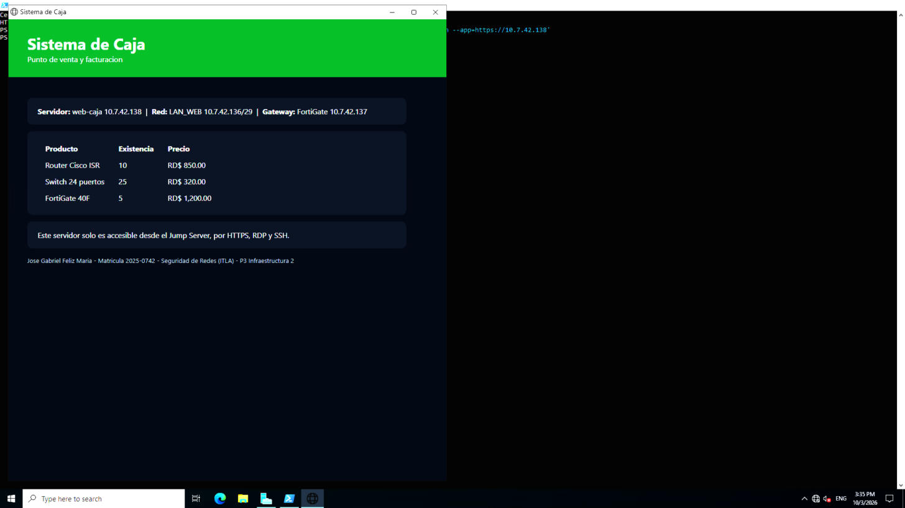

### Usuario con privilegios

En RD Web le aparecen las tres aplicaciones:

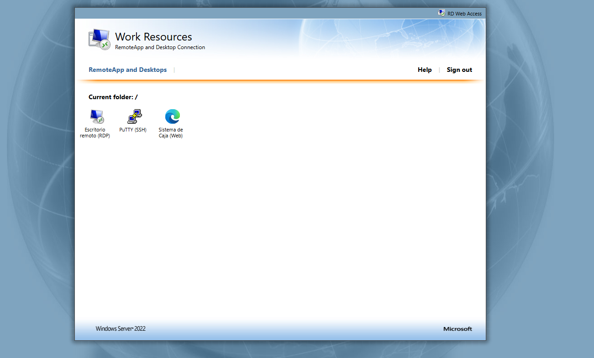

Al abrir una RemoteApp, Windows muestra el servidor como **editor verificado**, porque el certificado es de confianza:

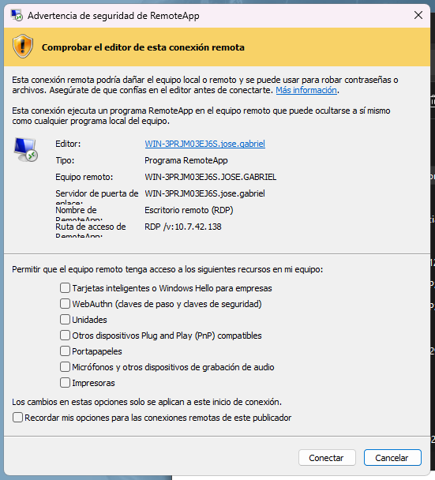

**Escritorio remoto (RDP):** el `mstsc` que se ve corre en el Jump Server y se conecta al Web Server.

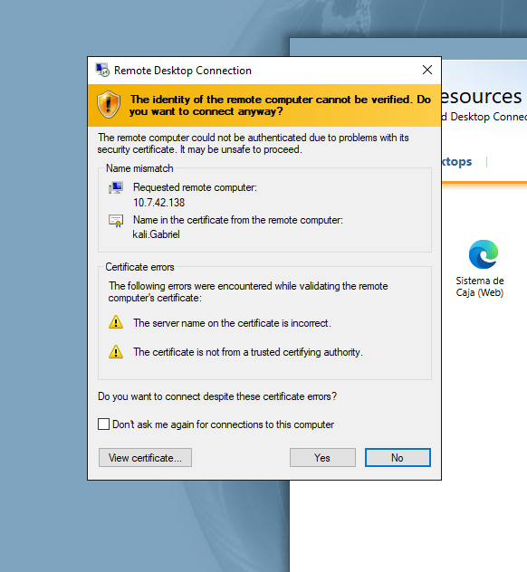

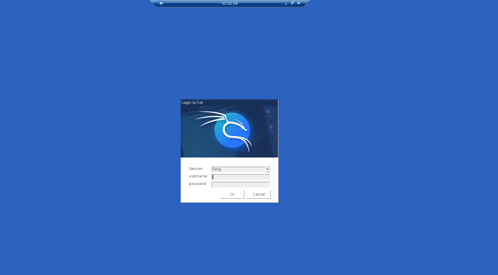

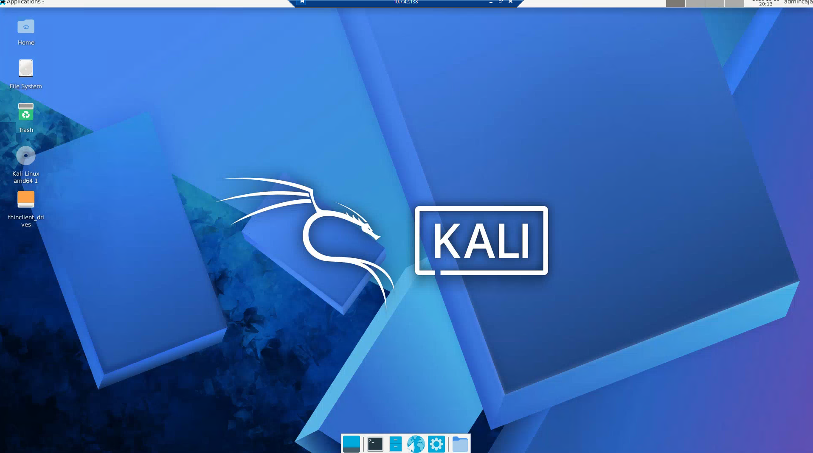

**PuTTY (SSH):** sesión como `admincaja` en el Web Server (`eth1 10.7.42.138`).

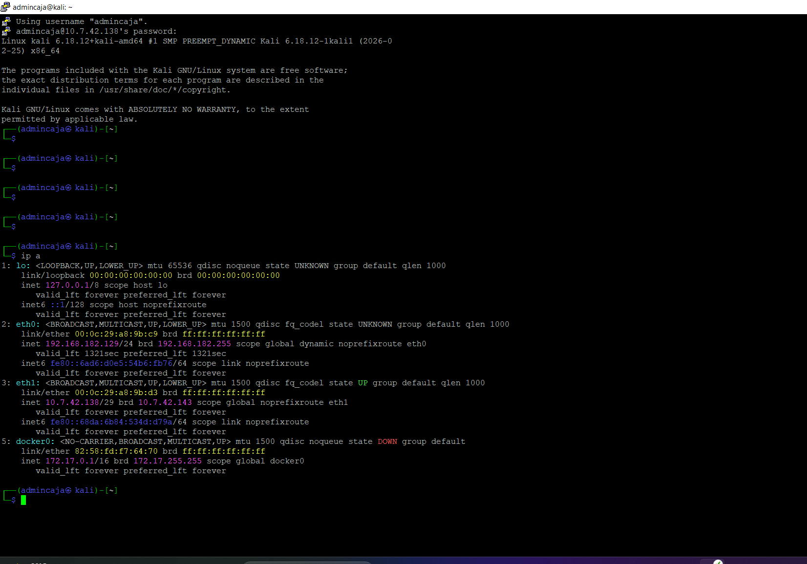

**Sistema de Caja (Web):**

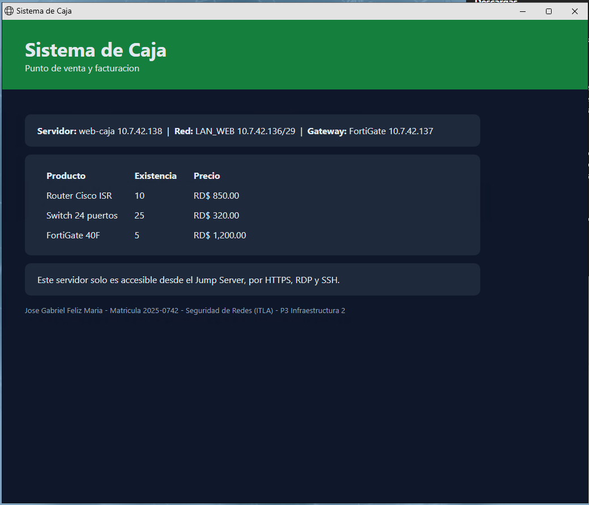

**RemoteApp Web Client:** la misma aplicación, dentro del navegador.

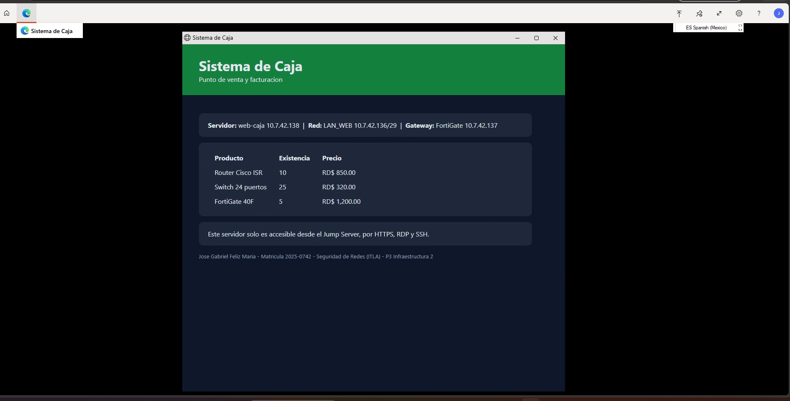

### Usuario sin privilegios

En RD Web solo le aparece la aplicación web:

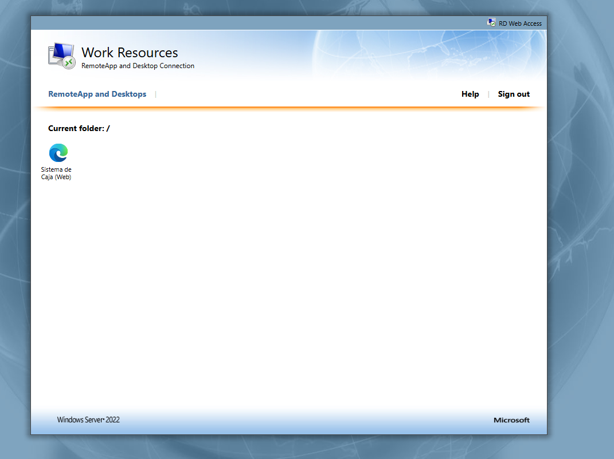

El SSH hacia los dos servidores no conecta:

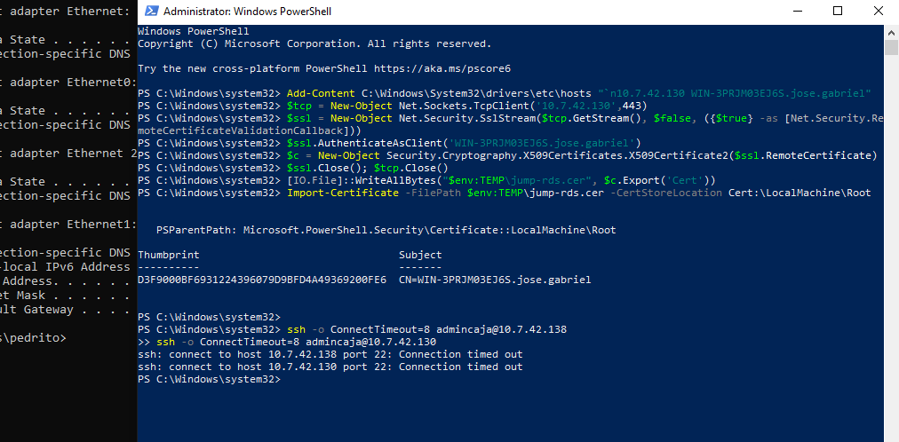

### Registros del FortiGate

Todo lo que no coincide con una política queda como *Deny: policy violation* con el *Policy ID 0* (Implicit Deny), y lo permitido aparece con el nombre de su política. En esta captura se ve que:

- El **Web Server** (`10.7.42.138`) y el **Jump Server** (`10.7.42.130`) intentan salir a Internet (`8.8.8.8`, `192.168.182.2`) y son bloqueados: los servidores no tienen salida.
- El **Jump Server** tampoco puede iniciar conexiones hacia la red de los usuarios (`10.7.42.1`).
- El usuario con privilegios (`10.7.42.20`) llega al Jump Server por la política `VPN_A_JUMP`.

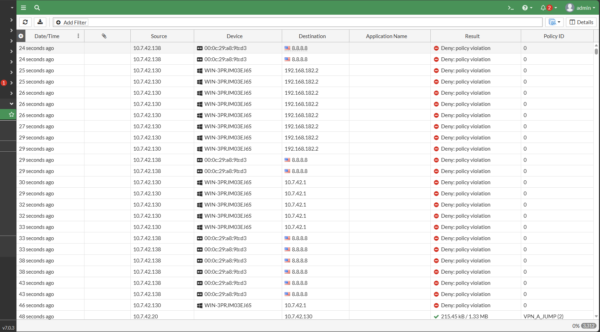

Filtrando por el **usuario sin privilegios** (`10.7.42.10`) se ve cada caso con su política:

- Sus intentos de **SSH** al Jump Server (`10.7.42.130`) y al Web Server (`10.7.42.138`) quedan como *Deny* por la política explícita `DENY_SSH_SIN_PRIVILEGIOS`.
- Su acceso a RD Web y a la RemoteApp se permite por `VPN_A_JUMP`.
- Cualquier otro puerto hacia el Jump Server cae en el *Implicit Deny* (*Policy ID 0*).

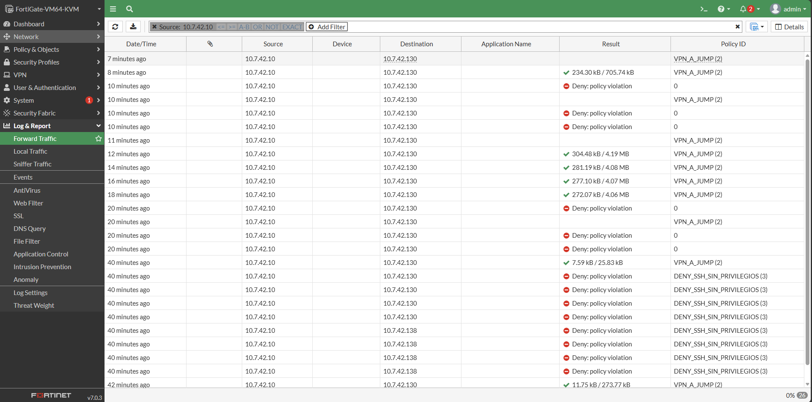

---

## 12. Problemas Encontrados y Soluciones

### 12.1 El Jump Server no llegaba al Web Server

La política `JUMP_A_WEB` contaba tráfico, pero los tres puertos fallaban. El Web Server tenía conectado un segundo adaptador con salida a Internet, y su ruta por defecto tenía mejor métrica que la de la LAN del servidor: las respuestas salían por ese adaptador y nunca volvían al FortiGate. **Solución:** se le dio prioridad a la ruta de la LAN del servidor (`ipv4.route-metric 50`) y se desconectó el adaptador de Internet.

### 12.2 El RDP al Web Server no abría el escritorio

`xrdp` autenticaba al usuario pero terminaba en *X server could not be started*: el Kali usa GNOME sobre Wayland y no traía el servidor Xorg que `xrdp` necesita. Se probó el Escritorio remoto integrado de GNOME, pero `mstsc` fallaba en la autenticación. **Solución:** se instalaron `xorgxrdp` y un escritorio liviano (XFCE) para las sesiones RDP, y se desactivó el servicio de escritorio remoto de GNOME, que seguía ocupando el puerto 3389 e impedía que `xrdp` arrancara.

### 12.3 Windows bloqueaba el archivo `.rdp`

En el PC con Windows 11, el Control inteligente de aplicaciones bloqueaba el `.rdp` que descarga RD Web. **Solución:** *Propiedades → Desbloquear* en el archivo, o usar el RemoteApp Web Client, que no descarga nada. No se desactivó la protección de Windows.

### 12.4 El certificado del Jump Server no se podía descargar

Se copió el certificado a IIS para que los clientes lo descargaran, pero la dirección devolvía un error 404 y la importación fallaba. **Solución:** el certificado se lee directamente del saludo TLS del servidor con PowerShell.

### 12.5 El Windows Server ya era controlador de dominio

El servidor disponible ya era controlador del dominio `jose.gabriel`, así que no se podía renombrar ni unir a otro dominio. **Solución:** se reutilizó ese dominio para RDS, con sus usuarios, y solo se crearon los dos grupos de la práctica.

### 12.6 No se podía copiar y pegar en el Windows Server

VMware Tools no se instaló (*Could not find component on update server*), así que la consola de la VM no tenía portapapeles. **Solución:** administrar el servidor por Escritorio remoto a través de la VPN, que sí lo tiene.

### 12.7 La política no dejaba elegir dos interfaces de destino

Al crear la negación de SSH, el formulario solo aceptaba una interfaz de destino. **Solución:** activar *System → Feature Visibility → Multiple Interface Policies* y editar la política para agregar la segunda LAN.

### 12.8 El Web Server sin enlace

La interfaz del Kali aparecía *DOWN* porque el adaptador de la red del servidor estaba desconectado en VMware. **Solución:** marcar *Connected* y *Connect at power on*.

---

## 13. Scripts y Running-Configs

| Archivo | Descripción |
|---|---|
| [`scripts/ISP_config.txt`](scripts/ISP_config.txt) | Configuración completa del ISP |
| [`scripts/R-CLIENTE_config.txt`](scripts/R-CLIENTE_config.txt) | R-CLIENTE: red, DHCP con reservas, NAT, seguridad básica y VPN |
| [`scripts/SW-A_config.txt`](scripts/SW-A_config.txt) | Configuración completa del switch SW-A |
| [`scripts/FGT-SERVIDOR_acceso_inicial_CLI.txt`](scripts/FGT-SERVIDOR_acceso_inicial_CLI.txt) | Acceso inicial por consola del FortiGate |
| [`scripts/JUMP-SRV_rds_remoteapp.ps1`](scripts/JUMP-SRV_rds_remoteapp.ps1) | Jump Server: certificado, RemoteApp, grupos, PuTTY y Web Client |
| [`scripts/cliente_confiar_certificado_jump.ps1`](scripts/cliente_confiar_certificado_jump.ps1) | Equipos de usuario: nombre del Jump Server y confianza en su certificado |
| [`scripts/kali_web_server_infra2.sh`](scripts/kali_web_server_infra2.sh) | Web Server: red, HTTPS, SSH y RDP |
| [`running-configs/FGT-SERVIDOR_running-config.conf`](running-configs/FGT-SERVIDOR_running-config.conf) | Backup de configuración del FortiGate (GUI → Configuration → Backup) |
| [`running-configs/ISP_running-config.txt`](running-configs/ISP_running-config.txt) | Running-config del ISP |
| [`running-configs/R-CLIENTE_running-config.txt`](running-configs/R-CLIENTE_running-config.txt) | Running-config del R-CLIENTE |
| [`running-configs/SW-A_running-config.txt`](running-configs/SW-A_running-config.txt) | Running-config del SW-A |
| [`running-configs/Kali_web_server_estado.txt`](running-configs/Kali_web_server_estado.txt) | Estado del Web Server: IP y puertos en escucha |
| [`diagramas/gen_diagrama.py`](diagramas/gen_diagrama.py) | Script (Python + matplotlib) que genera el diagrama |

> En el backup del FortiGate se redactaron (`<REDACTADO>`) los hashes de contraseñas, la clave de la VPN y las llaves privadas de los certificados, porque el repositorio es público. En el R-CLIENTE se omitió la línea de la clave de la VPN. Las contraseñas de los equipos Cisco son de laboratorio.

---

## 14. Evidencias (Capturas)

| # | Archivo | Descripción |
|---|---|---|
| 01 | [`01_topologia_pnetlab.png`](screenshots/01_topologia_pnetlab.png) | Topología en PNETLab |
| 02 | [`02_isp_interfaces_ping_internet.png`](screenshots/02_isp_interfaces_ping_internet.png) | ISP: interfaces y salida a Internet |
| 03 | [`03_r-cliente_ping_isp_internet.png`](screenshots/03_r-cliente_ping_isp_internet.png) | R-CLIENTE llega al ISP y a Internet |
| 04 | [`04_sw-a_vlan10_ping_gateway.png`](screenshots/04_sw-a_vlan10_ping_gateway.png) | SW-A: VLAN 10 y ping al gateway |
| 05 | [`05_pc_host_dhcp_reserva.png`](screenshots/05_pc_host_dhcp_reserva.png) | Usuario con privilegios: IP reservada por DHCP |
| 06 | [`06_r-cliente_ping_fortigate.png`](screenshots/06_r-cliente_ping_fortigate.png) | R-CLIENTE llega a la IP pública del FortiGate |
| 07 | [`07_fgt_interfaces.png`](screenshots/07_fgt_interfaces.png) | FortiGate: interfaces |
| 08 | [`08_fgt_ruta_por_defecto.png`](screenshots/08_fgt_ruta_por_defecto.png) | FortiGate: ruta por defecto |
| 09 | [`09_isp_ping_fortigate.png`](screenshots/09_isp_ping_fortigate.png) | El ISP llega al FortiGate |
| 10 | [`10_fgt_politicas_asistente_vpn.png`](screenshots/10_fgt_politicas_asistente_vpn.png) | Políticas creadas por el asistente de VPN |
| 11 | [`11_r-cliente_ping_por_tunel.png`](screenshots/11_r-cliente_ping_por_tunel.png) | Ping por el túnel desde el R-CLIENTE |
| 12 | [`12_fgt_tunel_vpn_up.png`](screenshots/12_fgt_tunel_vpn_up.png) | Túnel *Up* en el FortiGate |
| 13 | [`13_pc_host_ping_lan_jump_por_vpn.png`](screenshots/13_pc_host_ping_lan_jump_por_vpn.png) | Ping a la LAN del Jump Server por la VPN |
| 14 | [`14_r-cliente_crypto_isakmp_ipsec.png`](screenshots/14_r-cliente_crypto_isakmp_ipsec.png) | Fase 1 y fase 2 en el R-CLIENTE |
| 15 | [`15_kali_web_server_ping_fortigate.png`](screenshots/15_kali_web_server_ping_fortigate.png) | El Web Server llega a su gateway |
| 16 | [`16_pc_host_sin_acceso_al_web_server.png`](screenshots/16_pc_host_sin_acceso_al_web_server.png) | El usuario no llega al Web Server |
| 17 | [`17_jump_server_ip_fija_rdp_por_vpn.png`](screenshots/17_jump_server_ip_fija_rdp_por_vpn.png) | Jump Server: IP fija, administrado por la VPN |
| 18 | [`18_jump_server_manager_roles_iniciales.jpg`](screenshots/18_jump_server_manager_roles_iniciales.jpg) | Jump Server: roles antes de instalar RDS |
| 19 | [`19_jump_rds_quick_start_confirmacion.jpg`](screenshots/19_jump_rds_quick_start_confirmacion.jpg) | Asistente de RDS: confirmación |
| 20 | [`20_jump_rds_quick_start_completado.jpg`](screenshots/20_jump_rds_quick_start_completado.jpg) | Asistente de RDS: instalación completada |
| 21 | [`21_jump_rds_deployment_overview_4_roles.jpg`](screenshots/21_jump_rds_deployment_overview_4_roles.jpg) | Despliegue de RDS con los cuatro roles |
| 22 | [`22_jump_rds_certificado_y_remoteapps_powershell.jpg`](screenshots/22_jump_rds_certificado_y_remoteapps_powershell.jpg) | Certificado asignado y primeras RemoteApp |
| 23 | [`23_jump_remoteapps_publicadas_por_grupo.jpg`](screenshots/23_jump_remoteapps_publicadas_por_grupo.jpg) | Las tres RemoteApp con sus grupos |
| 24 | [`24_jump_rd_web_client_publicado.jpg`](screenshots/24_jump_rd_web_client_publicado.jpg) | RemoteApp Web Client publicado |
| 25 | [`25_jump_gateway_y_servicios_rds.jpg`](screenshots/25_jump_gateway_y_servicios_rds.jpg) | RD Gateway y servicios de RDS |
| 26 | [`26_jump_llega_al_web_server_443_3389_22.jpg`](screenshots/26_jump_llega_al_web_server_443_3389_22.jpg) | Jump Server → Web Server: 443, 3389 y 22 |
| 27 | [`27_jump_sistema_de_caja_https.jpg`](screenshots/27_jump_sistema_de_caja_https.jpg) | Sistema de Caja por HTTPS desde el Jump Server |
| 28 | [`28_jump_remoteapps_final_por_grupo.jpg`](screenshots/28_jump_remoteapps_final_por_grupo.jpg) | RemoteApp definitivas y grupos |
| 29 | [`29_rdweb_usuario_con_privilegios_tres_apps.png`](screenshots/29_rdweb_usuario_con_privilegios_tres_apps.png) | RD Web del usuario con privilegios |
| 30 | [`30_remoteapp_aviso_editor_verificado.png`](screenshots/30_remoteapp_aviso_editor_verificado.png) | RemoteApp con el editor verificado |
| 31 | [`31_remoteapp_rdp_llega_al_web_server.png`](screenshots/31_remoteapp_rdp_llega_al_web_server.png) | RemoteApp RDP: llega al Web Server |
| 32 | [`32_remoteapp_rdp_escritorio_del_web_server.png`](screenshots/32_remoteapp_rdp_escritorio_del_web_server.png) | RemoteApp RDP: escritorio del Web Server |
| 33 | [`33_remoteapp_putty_ssh_al_web_server.png`](screenshots/33_remoteapp_putty_ssh_al_web_server.png) | RemoteApp PuTTY: SSH al Web Server |
| 34 | [`34_fgt_politicas_definitivas.png`](screenshots/34_fgt_politicas_definitivas.png) | FortiGate: las tres políticas definitivas |
| 35 | [`35_remoteapp_rdp_login_xrdp_web_server.png`](screenshots/35_remoteapp_rdp_login_xrdp_web_server.png) | RemoteApp RDP: inicio de sesión de xrdp |
| 36 | [`36_remoteapp_sistema_de_caja_en_pc_usuario.png`](screenshots/36_remoteapp_sistema_de_caja_en_pc_usuario.png) | RemoteApp Sistema de Caja |
| 37 | [`37_cliente_web_html5_sistema_de_caja.png`](screenshots/37_cliente_web_html5_sistema_de_caja.png) | RemoteApp Web Client con el Sistema de Caja |
| 38 | [`38_rdweb_usuario_sin_privilegios_una_app.png`](screenshots/38_rdweb_usuario_sin_privilegios_una_app.png) | RD Web del usuario sin privilegios |
| 39 | [`39_win10_ssh_denegado_sin_privilegios.png`](screenshots/39_win10_ssh_denegado_sin_privilegios.png) | SSH denegado al usuario sin privilegios |
| 40 | [`40_fgt_implicit_deny_con_registro.png`](screenshots/40_fgt_implicit_deny_con_registro.png) | FortiGate: Implicit Deny con registro |
| 41 | [`41_fgt_log_forward_traffic.png`](screenshots/41_fgt_log_forward_traffic.png) | Logs: bloqueos del Implicit Deny y tráfico permitido |
| 42 | [`42_kali_web_server_solo_eth1.png`](screenshots/42_kali_web_server_solo_eth1.png) | Web Server: solo la interfaz de su LAN y puertos en escucha |
| 43 | [`43_fgt_log_ssh_denegado_usuario_sin_privilegios.png`](screenshots/43_fgt_log_ssh_denegado_usuario_sin_privilegios.png) | Logs: SSH negado al usuario sin privilegios por la política explícita |

---

## 15. Notas y Limitaciones del Laboratorio

- **Licencia de evaluación de FortiGate VM:** limita la VM a 3 interfaces, 3 políticas y 3 rutas, y solo permite cifrado **DES**. La VPN usa IKEv1 con DES/SHA1 porque es lo único disponible; en producción se usaría IKEv2 con AES-256 y SHA-256.
- **Gestión por port1 y por HTTP:** por el límite de interfaces, la GUI se administra por la interfaz del ISP y sin HTTPS. En producción la gestión iría en una interfaz dedicada, por HTTPS y limitada a equipos de confianza.
- **Usuarios identificados por IP en el firewall:** la política de negación usa la IP reservada del usuario sin privilegios. En producción se usarían políticas por identidad (usuarios y grupos del dominio) en el FortiGate.
- **Escritorio completo en el Jump Server:** para usar las RemoteApp, los usuarios inician sesión por RDP en el Jump Server, así que también pueden abrir un escritorio completo con `mstsc`. En este laboratorio la restricción del usuario sin privilegios se aplica en la publicación (solo ve la aplicación web) y en el firewall (SSH negado). La mejora pendiente es una directiva de grupo para `GRP_SinPrivilegios` que cierre toda sesión que no sea una RemoteApp (*Custom User Interface*), o AppLocker en el Jump Server.
- **Jump Server con todos los roles:** el mismo servidor es controlador de dominio y tiene los cuatro roles de RDS. En producción estarían separados y el RD Gateway usaría un certificado de una CA.
- **Certificados autofirmados:** el del Jump Server y el del Web Server se agregaron manualmente como de confianza donde hacía falta.
- **Servidores sin Internet:** no pueden actualizarse desde su LAN; el laboratorio no gasta una política en eso.
